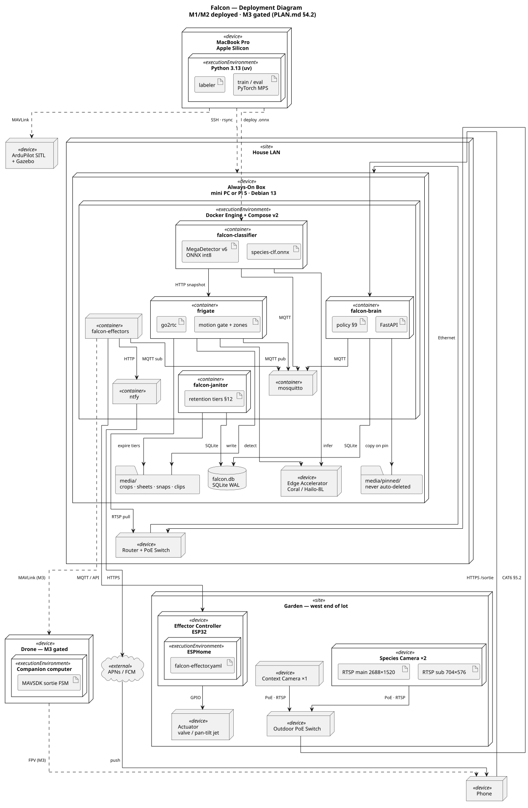

# Deployment

UML deployment view of Falcon: what runs where, and how the pieces talk.

**Canonical source: [`deployment.puml`](deployment.puml).** The image below is
generated from it — don't hand-edit the render. Regenerate with
`tools/render-diagrams.sh` (needs `java`, `graphviz`, and a `plantuml.jar`).

Scope: M1 and M2 as deployed, M3 shown dashed because it is gated on the New
Jersey wildlife question in [PLAN.md §4.2](PLAN.md).

## Nodes

### Garden — west end of the lot (PLAN.md §5.1)

| Node | Stereotype | Notes |
|---|---|---|
| Species Camera ×2 | device | Dahua/EmpireTech IPC-T5442T-ZE. Main 2688×1520 for snapshots, sub 704×576 for detection. Framed on beds, not the yard (§5). |
| Context Camera ×1 | device | Wide. Cannot do species ID — exists to show approach corridors for M2 deterrent placement. |
| Outdoor PoE Switch | device | Yard end of the single trenched CAT6 run (§5.2). |
| Effector Controller | device | ESP32 running ESPHome. M2. |
| Actuator | device | Solenoid valve or pan-tilt water jet. M2. |

### House LAN

| Node | Stereotype | Notes |
|---|---|---|
| Router + PoE Switch | device | House end of the trench. |
| Always-On Box | device | Mini PC or Pi 5, Debian 13. Hosts everything continuous (§6). |
| Edge Accelerator | device | Coral TPU or Hailo-8L. Serves both Frigate's detector and the classifier. |
| Docker Engine | executionEnvironment | Compose v2. |
| `frigate` | container | Ingest, motion gate, zones, recording, snapshot API. Embeds go2rtc. |
| `mosquitto` | container | MQTT broker — the event bus every service meets on. |
| `falcon-classifier` | container | MegaDetector v6 → species model. Sidecar, not a Frigate plugin (see below). |
| `falcon-brain` | container | Engagement policy (§9), audit log, HTTP API. |
| `falcon-effectors` | container | notify / sprinkler / audio / drone behind one interface. |
| `falcon-janitor` | container | Enforces the retention tiers (PLAN.md §11) over Falcon's own media directories. |
| `ntfy` | container | Self-hosted push with action buttons. |
| `falcon.db` | artifact | SQLite in WAL mode: events, decisions, audit trail. |
| `media/` | artifact | Crops, contact sheets, snapshots, clips — tiered retention (PLAN.md §11.3). |
| `media/pinned/` | artifact | Copied out of Frigate's managed storage on pin; never auto-deleted (§11.5–11.6). |

### Off-LAN

| Node | Stereotype | Notes |
|---|---|---|
| MacBook Pro | device | Labeling, training, evaluation. Deliberately **not** in the runtime path (§6). |
| Phone | device | Receives push, authorizes tap-to-launch (§3). |
| APNs / FCM | external | The only third-party dependency in M1/M2. |
| Drone + SITL | device | M3, gated. Flight code develops against SITL with no hardware. |

## Communication paths

| From | To | Protocol / port | Payload |
|---|---|---|---|
| Cameras | Outdoor PoE switch | 802.3af PoE; RTSP/TCP 554; ONVIF 80 | Power, video, PTZ/zoom control |
| Outdoor switch | House switch | 1000BASE-T over direct-burial CAT6 | 60–90 ft, one trench (§5.2) |
| `frigate` | Cameras | RTSP pull | Sub-stream → detection, main → recording |
| `frigate` | Edge accelerator | USB / PCIe | Detector inference |
| `frigate` | `mosquitto` | MQTT 1883 | `frigate/events` |
| `frigate` | `media/` | file I/O | Clips, snapshots |
| `falcon-classifier` | `mosquitto` | MQTT 1883 | sub `frigate/events`, pub `falcon/detections` |
| `falcon-classifier` | `frigate` | HTTP 5000 | `GET /api/events/{id}/snapshot.jpg` — **full-res**, because the detect sub-stream has too few px/ft for species ID (§5) |
| `falcon-classifier` | Edge accelerator | USB / PCIe | MegaDetector + species model |
| `falcon-brain` | `mosquitto` | MQTT 1883 | sub `falcon/detections`, pub `falcon/actions` |
| `falcon-brain` | `falcon.db` | SQLite | Events, decisions, audit |
| `falcon-brain` | `media/pinned/` | file I/O | Copies pinned media out of Frigate's lifecycle (§11.6) |
| `falcon-janitor` | `media/`, `falcon.db` | file I/O, SQLite | Expires tiers; skips pinned events |
| `falcon-effectors` | `mosquitto` | MQTT 1883 | sub `falcon/actions` |
| `falcon-effectors` | ESP32 | MQTT 1883 or ESPHome native API 6053 | Valve/servo commands |
| ESP32 | Actuator | GPIO | Relay, servo PWM |
| `falcon-effectors` | `ntfy` | HTTP 8080 | `POST /falcon` — snapshot + action button |
| `ntfy` | APNs/FCM → Phone | HTTPS | Push notification |
| Phone | `falcon-brain` | HTTPS 8080 | `POST /sortie` — tap-to-launch (§3) |
| MacBook | Always-On Box | SSH / rsync | Pull crops and clips into the training set |
| MacBook | `falcon-classifier` | scp | Deploy `species-clf.onnx` |
| MacBook | SITL | MAVLink UDP 14540 | M3 development, no hardware |

## Two design points the diagram encodes

**The classifier is a sidecar, not a Frigate detector plugin.** Frigate 0.17
added native object classification, so this is now a real choice rather than a
workaround. The sidecar still wins here for three reasons: model iteration
never touches NVR config; the classifier needs the *full-resolution* snapshot
rather than the detect sub-stream Frigate's own pipeline runs on (§5); and
swapping or A/B-ing models is a container restart. Revisit if Frigate's native
path matures enough to carry the two-stage pipeline.

**Retention is owned in one place.** Frigate manages its own media lifecycle
and would happily delete a clip the policy wanted pinned. So Frigate gets a
short window (~10 days), `falcon-brain` copies pinned media *out* of that
storage on write, and `falcon-janitor` enforces the tiers over Falcon's
directories only. Two storage areas, one owner each — rather than two
retention engines arguing over the same files.

**MQTT is the seam.** Every service meets on the broker, so effectors are
genuinely pluggable — `DroneEffector` subscribes to the same `falcon/actions`
topic as `SprinklerEffector`, and the detection half never learns which one is
attached. That is what keeps the M3 legal gate (§4.2) from blocking anything
else.
